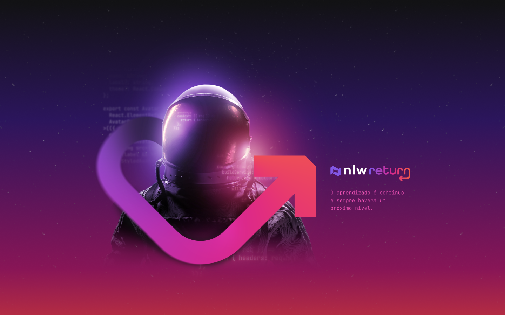
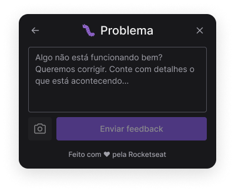
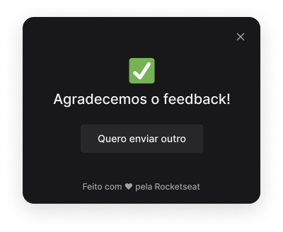

# NLW-RETURN IMPULSE

  

  &#xa0;

  <!-- <a href="https://NLW8.0---web.netlify.app">Demo</a> -->

<h1 align="center">NLW #08 - Return</h1>

  

  

  

  

 

## :dart: Sobre ##

Sera desenvolvido um Widget para receber FeedBack!

## :sparkles: Funcionalidades ##

:heavy_check_mark: Funcionalidade ao clicar no botão Feedback;\
:heavy_check_mark: Abrir Popover;

## 💻 Telas da aplicação

  
  
  
  

  

  

## :rocket: Tecnologias ##

Este projeto está sendo criado utilizando as seguintes tecnologias:

- [React](https://pt-br.reactjs.org/)
- [Vite](https://vitejs.dev/)
- [TypeScript](https://www.typescriptlang.org/)
- [Tailwindss](https://tailwindcss.com/)
- [PostCSS](https://postcss.org/)
- [Phosphor](https://phosphoricons.com/)
- [Headlessui](https://headlessui.dev/)